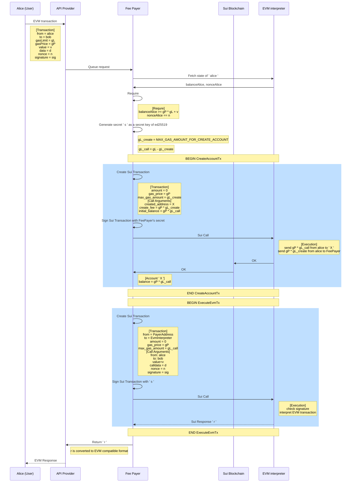

# Proxy Service

# Proxy Server
Proxy server submits two transactions to Sui blockchain for every single EVM transaction:
1. CreateAccountTx
2. ExecuteEvmTx 

## CreateAccountTx transaction
- signer: `FeePayer`

For every EVM request, we create new Sui account called `CallerAccount` with an initial balance set by `gasPrice*gasLimit - <FEE_OF_CreateAccountTx>`. This initial balance is sent from User's EVM account in our EVM interpreter state. And `CallerAccount` will pay fee for the following transaction that executes EVM call. 

 The reason why `FeePayer` account doesn't directly call EVM is to prevent an expensive execution from draining fee pool balance. The fee amount paid for this transaction will be returned to `FeePayer` in **ExecuteEvmTx** transaction. We must make sure that failing **CreateAccountTx** is not broadcasted to blockchain. Like Ethereum, a failed transaction will cost fee and such transaction itself could become an attack to the fee pool.
## ExecuteEvmTx transaction
- signer: `CallerAccount`

`CallerAccount` calls EVM interpreter module which executes EVM bytecode specified in an user-submitted EVM transaction. This transaction might be expensive. But, the maximum gas that can be paied is capped by the balance of `CallerAccount`. Therefore a maliciously expensive EVM will not drain fund from `FeePayer`.

## Intrinsic Fee
Every interaction with EVM Interpreter will cost additional fee on top of blockchain fee. This is like a "tax" to EVM users. This ensures the protocol subtainability. 

# Diagram

